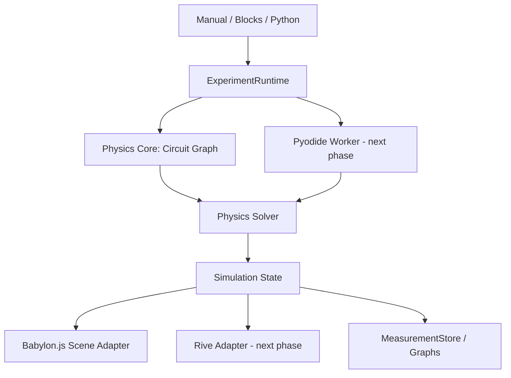

# Architecture

PHYSICS://LAB строится вокруг принципа: **визуализация никогда не является источником физической истины**.

## Boundary rules

- `src/core` не импортирует Babylon.js, DOM, Rive или Blockly.
- 3D клемма содержит только ссылку на `TerminalId`.
- 3D-провод отображает `Connection`; удаление визуального объекта не должно менять физику напрямую.
- UI меняет параметры через `SimulationRuntime`.
- Graph/Table читают `MeasurementStore`, а не вычисляют физические значения самостоятельно.

## Current vertical slice

`SimulationRuntime` хранит `CircuitModel` и пересчитывает `SimulationResult` после каждого изменения параметров или топологии.

`solveCircuit()` строит граф проводимости:

- Wire соединяет две внешние клеммы.
- Resistor и Ammeter дают внутреннее проводящее ребро.
- Voltmeter не участвует в основном пути тока в идеальной модели.
- VoltageSource не замыкается внутренним ребром: solver ищет внешний путь от `source.+` к `source.-`.

Это позволяет отличить:

- open circuit;
- корректно замкнутую цепь;
- путь без нагрузки / short circuit;
- отсутствие амперметра;
- обратную полярность амперметра;
- неправильное параллельное подключение вольтметра.

## Next architecture layers

### Pyodide

`PhysicsWorkerClient -> Web Worker -> Pyodide -> solver.py`.

API должен возвращать сериализуемый `SimulationResult`, чтобы Babylon/Rive/UI не зависели от места выполнения физического solver.

### Blocks / Python

Оба режима должны работать через один `Experiment AST` и `ExperimentApi`:

`Blocks -> AST -> Runtime`

`AST -> Python generator`

`Python -> restricted ExperimentApi -> Runtime`

### Rive

Rive подключается как `VisualAdapter` и получает только данные `SimulationState`: current, voltage, overload, connected и т.д.
